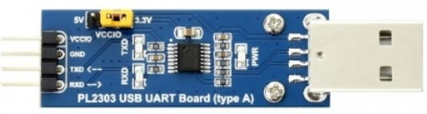

# DeDitrich MCR3 connectivity using Remeha as PCU05 module

Ready class with example of usage for connecting DeDitrich MCR3 boiler on RS232 using Remeha protocol as PCU-05 module. the exported class is a seperate thread that can (re)connect, read parts of Sample, Params, IDs and finnaly can write params. 
Used device [https://botland.com.pl/konwertery-usb-uart-rs232-rs485/21639-konwerter-usb-uart-ttl-pl2303-wtyk-usb-a-wersja-v2-waveshare-20265.html?cd=18298825651&ad=&kd=&gad_source=1&gclid=Cj0KCQjw3ZayBhDRARIsAPWzx8oK4hMIQETzEfI920MmHYS5eLTmSMV_LnCyBHlagrI80UE5kLKQSH8aAkzVEALw_wcB](Converter USB-UART (TTL) - PL2303 - wtyk USB A - wersja V2 - Waveshare 20265)

## Version 1.0
- self-organizing thread
- connecting boiler and reconnecting if disconnected
- reads in the loop all params and interpretates only switch of CH and DHW
- requests writing new settings for switching ON/OFF for CH and DHW

## Many thanks to great and helpful works from:
 - [https://github.com/rjblake/remeha](Remeha Boiler connectivity using ESP8266 by Rjblake)
 - [https://github.com/rjblake/remeha](Dietrich (Remeha) Boiler connectivity using ESP8266 with ESPHOME by Rjblake),
 - [https://github.com/manio/hard](Hard by Manio),
 - [https://skyboo.net/2017/03/connecting-dedietrich-mcr3-to-pc-via-serial-connection/](Blog: Connecting DeDietrich MCR3 to PC via serial connection)
 for creating maping of data in excel file and many useful solutions and advices.

## ToDo:
 - completing the map of parameters to read crucial data as temperature, working modes etc.
